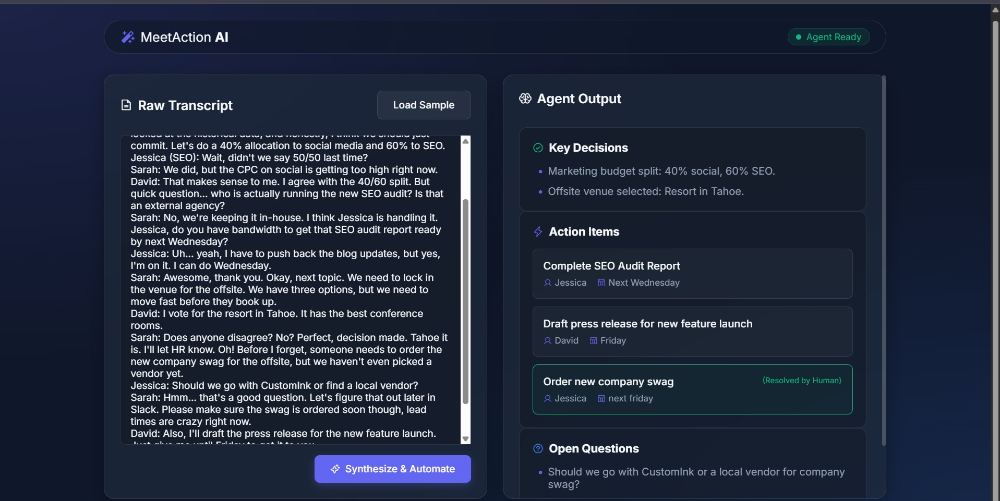

# MeetAction AI: Meeting-to-Action Pipeline ⚡️

**Live Demo:** [https://meetaction-ai.netlify.app](https://meetaction-ai.netlify.app)

MeetAction AI is an agentic workflow automation tool designed to solve a universally dreaded problem: post-meeting synthesis. It takes messy, unstructured meeting transcripts and autonomously extracts actionable data, while knowing exactly when to escalate to a human.

## 🎯 The Problem
Professionals waste hours manually scrubbing through meeting transcripts to figure out "What was decided?" and "Who is doing what?". Standard LLM summarizers generate paragraphs, but teams don't need paragraphs—they need structured tasks and tickets.

## 🧠 Agentic Architecture

The agent operates in three layers:
1. **Input Layer:** Ingests raw, conversational transcripts (complete with cross-talk and tangents).
2. **Processing Layer:** Autonomously categorizes the text into strict buckets: Decisions, Action Items, and Open Questions. It extracts task owners and deadlines where context is explicit.
3. **Escalation Layer (Human-in-the-loop):** The agent features built-in confidence thresholds. If it detects a task (e.g., "Someone needs to order swag") but cannot identify a specific owner or deadline, it **escalates**. Instead of hallucinating data, it routes the task to a "Human Review Required" queue so the user can resolve the missing context before exporting.

## 🚀 How to Use (Local Testing)
If you want to run the agent locally rather than using the live link:
1. Clone this repository.
2. Open `index.html` in your web browser.
3. Click **"Load Sample"** to load a messy transcript.
4. Click **"Synthesize & Automate"** to watch the agent parse the data and trigger the escalation flow.

## 🛠 Tech Stack
- Vanilla HTML5 / CSS3 (Glassmorphism UI)
- Vanilla JavaScript
- Phosphor Icons
- *Note: To ensure immediate testability without API keys, this repository uses an intelligent mock-parsing logic that responds to specific transcript triggers.*
